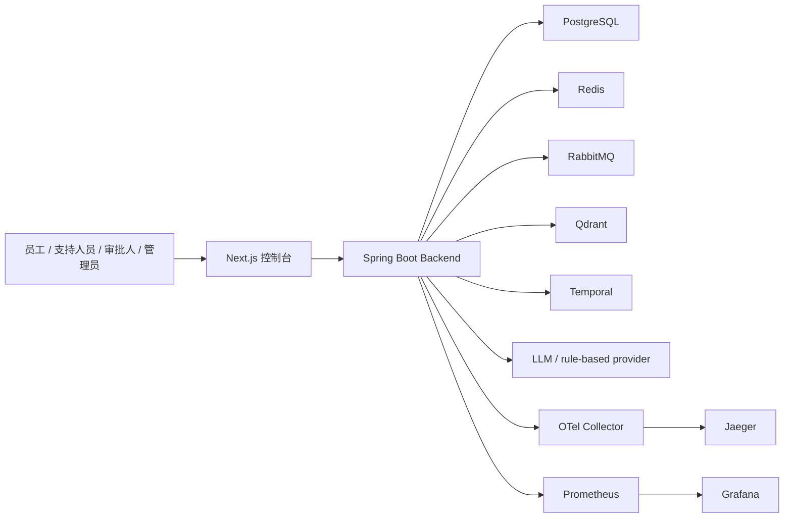
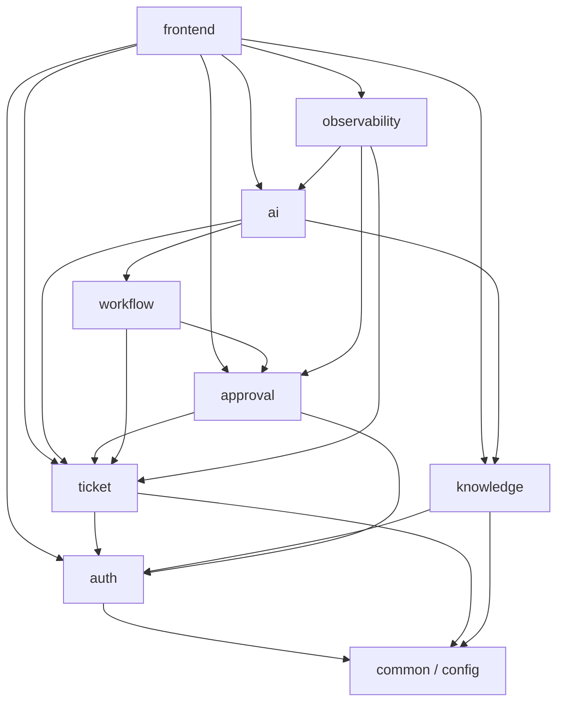
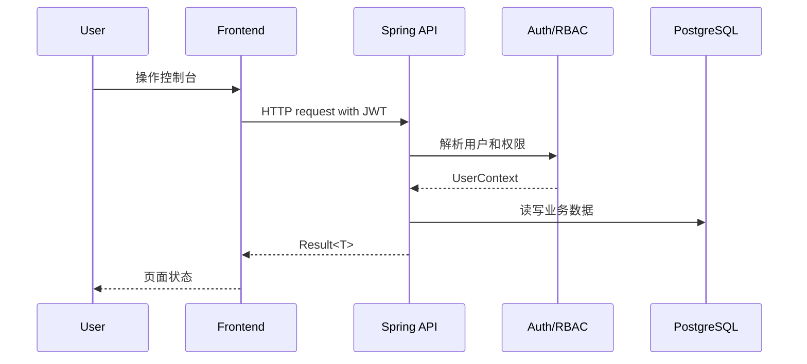
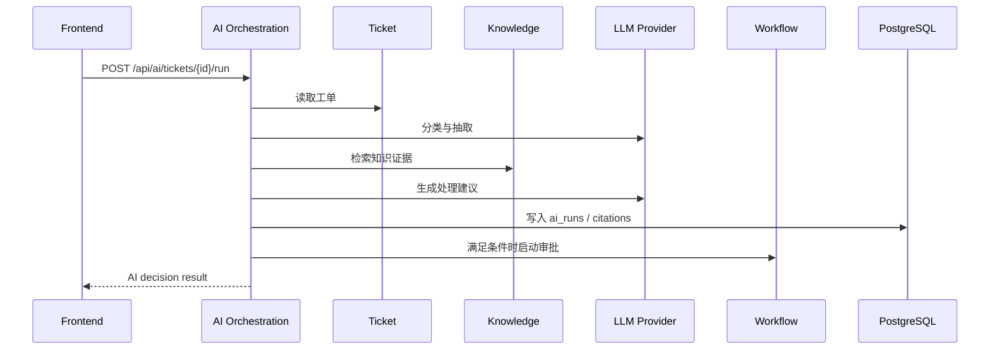
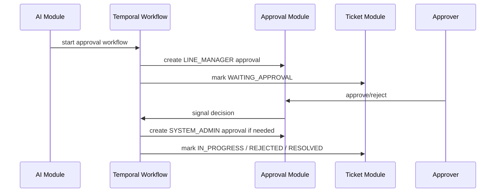

# 系统架构文档

Status: Active  
Owner: Project Lead  
Last Verified: 2026-04-27  
Source of Truth: 本文件是系统架构、模块关系、调用链路、部署拓扑和关键技术决策的事实源。  
Related Docs: [PRD](PRD.md), [Modules](MODULES.md), [API Contracts](API_CONTRACTS.md), [Operations](OPERATIONS.md), [ADR](ADR)

## 适用范围

- 描述企业级 AI 工单编排系统 MVP 的整体架构。
- 定义模块之间如何协作，以及请求、AI、检索、审批和观测链路如何串联。
- 记录当前关键技术选择和已知限制。

## 非目标

- 不逐项列出所有 HTTP API；见 [API Contracts](API_CONTRACTS.md)。
- 不维护数据表字段；见 [Data Model](DATA_MODEL.md)。
- 不写模块内部实现细节；见 [Modules](MODULES.md)。

## 系统上下文

用户只通过前端或 HTTP API 进入系统。后端是业务事实源，外部存储和中间件只承载数据、向量、异步、工作流和观测能力。

## 模块图

详细职责见 [Modules](MODULES.md)。任何新增模块依赖必须更新此图和 `MODULES.md`。

## 请求链路

所有业务接口必须返回统一 `Result<T>`，鉴权和错误语义见 [API Contracts](API_CONTRACTS.md)。

## AI 编排链路

AI 输出必须结构化，禁止让自然语言成为跨模块唯一契约。

## 异步与审批链路

workflow 和 activity 必须按幂等设计，重复 signal 或 replay 不得造成重复审批项或非法状态。

## 部署拓扑

| 名称 | 类型 | 是否必填 | 默认值 | 说明 | 变更影响 |
| --- | --- | --- | --- | --- | --- |
| `frontend` | Process | 是 | Next.js dev/server | 控制台 UI | 影响前端部署 |
| `backend` | Process | 是 | Spring Boot | 业务 API、AI、workflow worker | 影响所有模块 |
| `postgres` | Service | 是 | Docker Compose | 业务库 | 影响 migration 和备份 |
| `redis` | Service | 是 | Docker Compose | 缓存基础设施 | 影响运维 |
| `rabbitmq` | Service | 是 | Docker Compose | 异步基础设施 | 影响运维 |
| `qdrant` | Service | 是 | Docker Compose | 向量数据库 | 影响知识检索 |
| `temporal` | Service | 是 | Docker Compose | 审批 workflow | 影响审批 |
| `otel-collector` | Service | 否 | Docker Compose | trace 汇聚 | 影响观测 |
| `prometheus` | Service | 否 | Docker Compose | 指标采集 | 影响观测 |
| `grafana` | Service | 否 | Docker Compose | dashboard | 影响观测 |
| `jaeger` | Service | 否 | Docker Compose | trace UI | 影响排障 |

## 关键技术决策

| 名称 | 类型 | 是否必填 | 默认值 | 说明 | 变更影响 |
| --- | --- | --- | --- | --- | --- |
| Spring Boot | Decision | 是 | 3.3.6 | 适合企业后端、Security、JPA、Actuator 和 OpenAPI | 变更需 ADR |
| Next.js + Ant Design | Decision | 是 | Next.js 15 | 快速构建企业控制台 | 变更需 ADR |
| Flyway | Decision | 是 | Enabled | 数据库 schema 可追踪 | 变更需 ADR |
| Qdrant | Decision | 是 | v1.9.5 | 独立向量存储，便于 RAG 扩展 | 变更需 ADR |
| Temporal | Decision | 是 | 1.25.2 | 审批长流程和 signal/replay 语义清晰 | 变更需 ADR |
| OpenAPI | Decision | 是 | `/api-docs` | API 契约以代码生成结果为准 | 变更需更新测试 |

## 已知限制

| 名称 | 类型 | 是否必填 | 默认值 | 说明 | 变更影响 |
| --- | --- | --- | --- | --- | --- |
| 单体后端 | Limitation | 是 | 单进程 | MVP 使用模块化单体，未拆微服务 | 后续拆分需重新设计契约 |
| 固定审批模板 | Limitation | 是 | 两级审批 | 不支持用户自定义 workflow | 后续扩展需产品和数据设计 |
| 演示账号初始化 | Limitation | 是 | dev seed | 不适合生产用户管理 | 生产化需身份源集成 |
| AI provider 可回退 | Limitation | 是 | rule-based | LLM 不可用时走规则 provider | 影响演示质量 |

## 维护规则

- 新增外部服务、模块依赖、关键链路或技术替换时，必须更新本文件。
- 重大技术选择必须新增 ADR。
- 架构图必须与代码 package 和部署文件保持一致。
