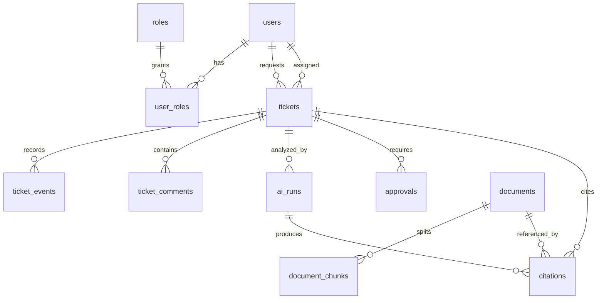
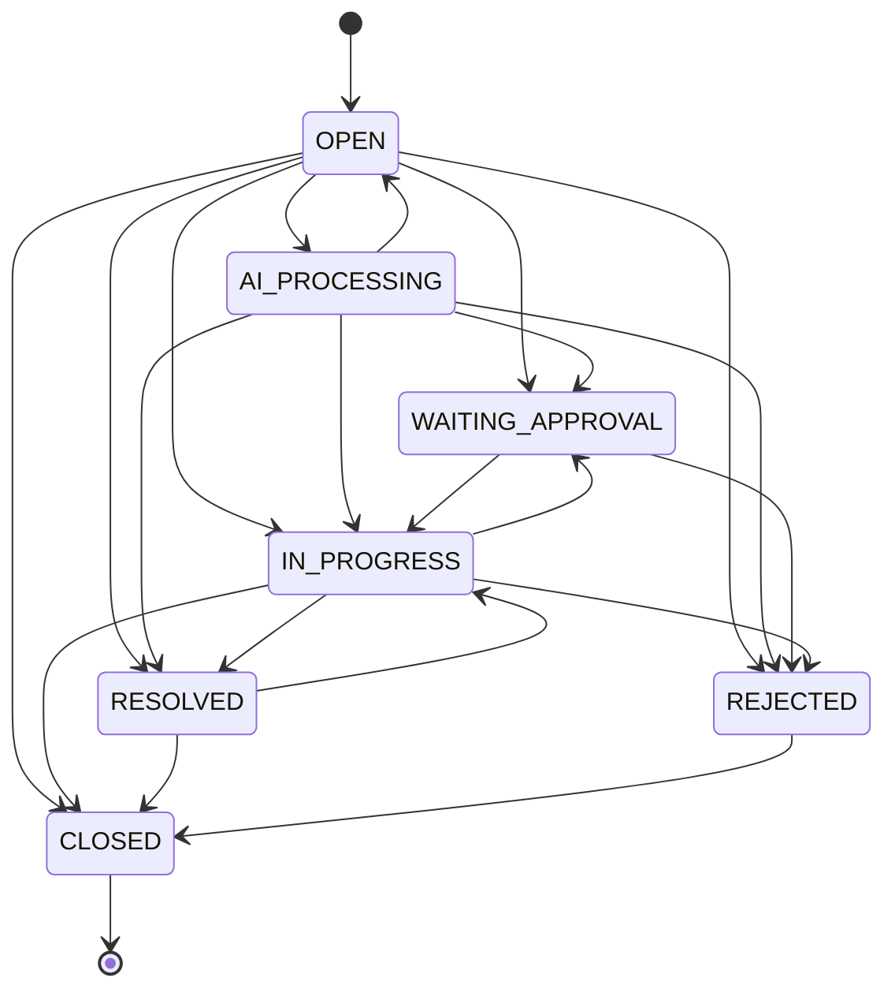

# 数据模型文档

Status: Active  
Owner: Project Lead  
Last Verified: 2026-04-27  
Source of Truth: 本文件是核心数据表、枚举、状态机和 migration 规则的事实源；真实 schema 以 Flyway migration 为准。  
Related Docs: [API Contracts](API_CONTRACTS.md), [Modules](MODULES.md), [Security](SECURITY.md), [Testing](TESTING.md)

## 适用范围

- 定义 MVP 业务数据模型、实体关系、状态机、枚举、索引和迁移规则。
- 指导后续 thread 在修改数据结构时保持统一口径。
- 为接口、测试、排障和审计提供数据语义说明。

## 非目标

- 不复制每个 JPA entity 的完整字段。
- 不维护 API request/response DTO；见 [API Contracts](API_CONTRACTS.md)。
- 不作为数据库唯一真实 schema；真实 schema 以 `backend/src/main/resources/db/migration` 为准。

## ER 关系

## 核心表

| 名称 | 类型 | 是否必填 | 默认值 | 说明 | 变更影响 |
| --- | --- | --- | --- | --- | --- |
| `roles` | Table | 是 | seed | 系统角色字典，code 对应 `SystemRole` | 影响 RBAC |
| `users` | Table | 是 | seed | 演示用户和用户基础信息 | 影响认证和权限 |
| `user_roles` | Table | 是 | seed | 用户角色关联 | 影响 RBAC |
| `tickets` | Table | 是 | 无 | 工单主表，保存标题、描述、分类、优先级、状态、请求人、处理人 | 影响所有业务链路 |
| `ticket_events` | Table | 是 | 无 | 工单事件时间线，记录状态、AI、审批、系统事件 | 影响审计 |
| `ticket_comments` | Table | 是 | 无 | 工单评论 | 影响协作和前端 |
| `documents` | Table | 是 | 无 | 知识文档元数据和索引状态 | 影响知识库 |
| `document_chunks` | Table | 是 | 无 | 文档切分片段和向量点位元信息 | 影响检索 |
| `citations` | Table | 是 | 无 | 工单/AI run 引用的知识证据 | 影响 RAG 可追踪性 |
| `ai_runs` | Table | 是 | 无 | AI 编排执行日志、输出和 fallback 信息 | 影响审计和监控 |
| `approvals` | Table | 是 | 无 | 审批项、阶段、审批人、状态和 workflow id | 影响 workflow |

## 工单状态机

| 名称 | 类型 | 是否必填 | 默认值 | 说明 | 变更影响 |
| --- | --- | --- | --- | --- | --- |
| `OPEN` | TicketStatus | 是 | 创建默认 | 新工单或 AI 回退后重开 | 影响列表和 AI |
| `AI_PROCESSING` | TicketStatus | 是 | 无 | AI 编排处理中 | 影响 AI run |
| `WAITING_APPROVAL` | TicketStatus | 是 | 无 | 等待审批 | 影响审批页 |
| `IN_PROGRESS` | TicketStatus | 是 | 无 | 人工或系统处理中 | 影响支持人员流程 |
| `RESOLVED` | TicketStatus | 是 | 无 | 已解决，等待关闭或重开 | 影响员工确认 |
| `CLOSED` | TicketStatus | 是 | 终态 | 已关闭，不再流转 | 影响状态校验 |
| `REJECTED` | TicketStatus | 是 | 可转 CLOSED | 审批驳回或请求拒绝 | 影响审批 |

## 枚举

| 名称 | 类型 | 是否必填 | 默认值 | 说明 | 变更影响 |
| --- | --- | --- | --- | --- | --- |
| `SystemRole` | Enum | 是 | `EMPLOYEE`/`SUPPORT_AGENT`/`APPROVER`/`ADMIN` | 系统角色 | 影响权限和 seed |
| `TicketPriority` | Enum | 是 | `MEDIUM` | `LOW`、`MEDIUM`、`HIGH`、`URGENT` | 影响工单排序和 AI |
| `KnowledgeDocumentCategory` | Enum | 是 | `OTHER` | 标准 IT 服务类别，如 `REMOTE_ACCESS`、`ACCESS_REQUEST` 等 | 影响工单和文档分类 |
| `KnowledgeAccessLevel` | Enum | 是 | 无 | `PUBLIC`、`INTERNAL`、`RESTRICTED`、`CONFIDENTIAL` | 影响检索权限 |
| `DocumentIndexStatus` | Enum | 是 | `PENDING` | `PENDING`、`INDEXED`、`FAILED` | 影响文档列表 |
| `AiRunStatus` | Enum | 是 | 无 | `SUCCESS`、`FAILED` | 影响 AI 审计 |
| `AiNodeName` | Enum | 是 | 无 | `CLASSIFIER`、`EXTRACTOR`、`RETRIEVER`、`RESOLUTION`、`ORCHESTRATION` | 影响 AI 日志 |
| `AiRetrievalStatus` | Enum | 是 | 无 | `HIT`、`EMPTY`、`ERROR`、`UNAVAILABLE` | 影响审批触发和人工复核 |
| `ApprovalStatus` | Enum | 是 | `PENDING` | `PENDING`、`APPROVED`、`REJECTED` | 影响审批幂等 |
| `ApprovalStageKey` | Enum | 是 | 无 | `LINE_MANAGER`、`SYSTEM_ADMIN` | 影响 workflow |

## 索引和约束

| 名称 | 类型 | 是否必填 | 默认值 | 说明 | 变更影响 |
| --- | --- | --- | --- | --- | --- |
| `idx_tickets_status` | Index | 是 | 无 | 工单状态筛选 | 影响列表性能 |
| `idx_tickets_requester_id` | Index | 是 | 无 | requester 权限过滤 | 影响安全性能 |
| `idx_ticket_events_ticket_created_at` | Index | 是 | 无 | 时间线排序 | 影响详情页 |
| `idx_documents_category` | Index | 是 | 无 | 文档分类筛选 | 影响知识库 |
| `idx_documents_access_level` | Index | 是 | 无 | 访问级别过滤 | 影响检索权限 |
| `idx_citations_ticket_id` | Index | 是 | 无 | 工单引用查询 | 影响详情页 |
| `idx_ai_runs_ticket_created_at` | Index | 是 | 无 | AI run 查询 | 影响详情页 |
| `idx_approvals_approver_status` | Index | 是 | 无 | 待审批列表 | 影响审批页 |

## Migration 规则

| 名称 | 类型 | 是否必填 | 默认值 | 说明 | 变更影响 |
| --- | --- | --- | --- | --- | --- |
| 文件命名 | Rule | 是 | `V{N}__description.sql` | 只增不改已发布 migration | 影响部署 |
| Schema 管理 | Rule | 是 | Flyway | `ddl-auto` 必须保持 `none` | 影响数据安全 |
| 回滚策略 | Rule | 是 | 前滚修复 | MVP 使用新 migration 修复，不编辑旧 migration | 影响发布 |
| 文档同步 | Rule | 是 | Required | 表、字段、枚举、索引变更必须更新本文件 | 影响评审 |

## 维护规则

- 新增表、字段、索引、枚举或状态流转时，必须更新本文件。
- 状态机变更必须同步更新 `TicketStatusTest` 和相关 E2E。
- 数据访问权限变更必须同步更新 [Security](SECURITY.md)。
